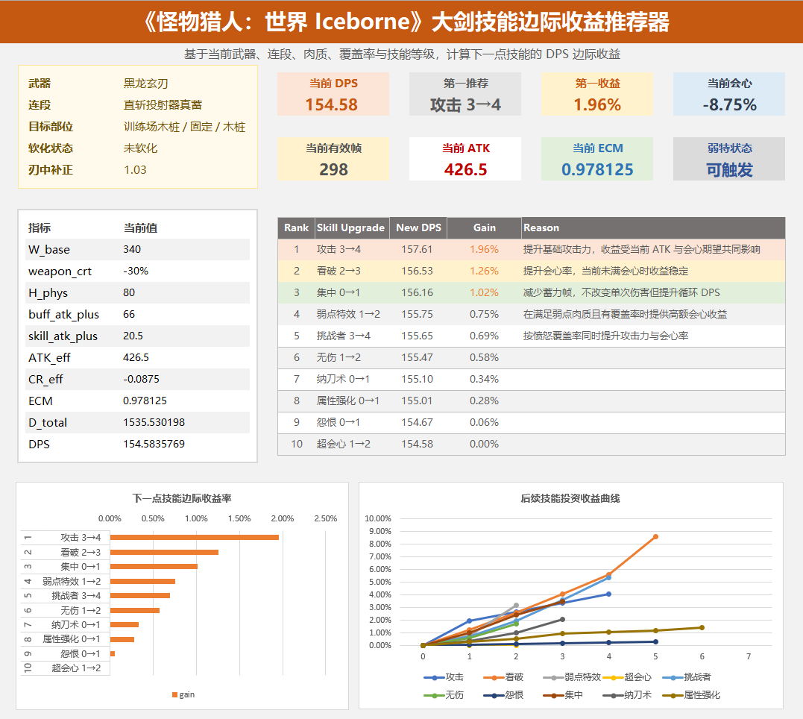

# Monster Hunter: World Iceborne Combat Numerical Analysis

A portfolio repository focused on combat numerical modeling, skill marginal value recommendation, and design analysis in Monster Hunter: World Iceborne.

This project uses Monster Hunter as a case study to demonstrate game numerical design, data modeling, combat system analysis, and tool-based presentation.

---

## Portfolio Overview

This repository contains three connected modules:

| Module | Focus | Output |
| --- | --- | --- |
| Great Sword Skill Priority Recommender | Numerical tool | Excel workbook, dashboard, exported data |
| Great Sword Stat Budget Analysis | Data analysis | weapon data, EFR analysis, visualization |
| Boss Battle Design Article | Qualitative design analysis | PDF article and summary |

Together, these modules show a complete analysis chain:

```
combat formula → data model → skill recommendation → design reflection → player behavior
```

---

## 1. Great Sword Skill Priority Recommender

The main project is an Excel / Google Sheets based MVP that evaluates skill priority for Monster Hunter: World Iceborne Great Sword builds.

Given a current combat state, the tool:

1. calculates current DPS
2. simulates each candidate skill gaining one level
3. recalculates DPS
4. computes marginal gain
5. ranks skills by next-point DPS value

Core formula:

```
gain = DPS_new / DPS_current - 1
```

### Key Features

- true raw based damage model
- physical and elemental damage split
- positive and negative affinity support
- Expected Critical Multiplier, or ECM
- Weakness Exploit hitzone logic
- tenderized hitzone handling
- Focus frame reduction
- Quick Sheath frame reduction
- conditional skill coverage approximation
- recommendation ranking
- future skill investment curve
- portfolio-ready dashboard

### Folder

```
skill-priority-recommender/
```

Recommended entry point:

```
skill-priority-recommender/README.md
```

---

## 2. Great Sword Stat Budget Analysis

This module analyzes Great Sword final-upgrade weapon data.

It focuses on weapon stat allocation and theoretical weapon value.

Possible analysis topics include:

- true raw
- affinity
- element
- sharpness
- theoretical EFR
- weapon source classification
- outlier detection
- rarity or progression-related stat budget

This module supports the broader portfolio by showing data collection, cleaning, analysis, and visualization ability.

---

## 3. Boss Battle Design Article

The `articles/` folder contains a qualitative design essay:

```
boss_battle_design_in_monster_hunter_series.pdf
```

This article analyzes Monster Hunter boss battle design from a systems and player-experience perspective.

Topics include:

- bosses as learnable systems
- readability and fairness
- attack commitment
- risk-reward design
- monster states and combat rhythm
- part-based hitzone design
- preparation and mastery
- relationship between boss design and numerical design

This article complements the numerical model by explaining how combat numbers connect to player behavior.

---

## Repository Structure

```
mhw-combat-numerical-analysis/
├── README.md
├── docs/
│   ├── 00_project_overview.md
│   ├── 01_damage_formula.md
│   ├── 02_data_model.md
│   ├── 03_skill_priority_recommender.md
│   ├── 04_test_cases.md
│   ├── 05_model_limitations.md
│   ├── 06_future_work.md
│   └── 07_design_reflection.md
│
├── skill-priority-recommender/
│   ├── README.md
│   ├── MHW_Iceborne_GS_Skill_Recommender.xlsx
│   ├── MHW_Iceborne_GS_Skill_Recommender.pdf
│   ├── exports/
│   ├── screenshots/
│   └── notes/
│       ├── formulas.md
│       ├── validation_notes.md
│       └── dashboard_design.md
│
├── greatsword-stat-budget-analysis/
│   ├── README.md
│   ├── data/
│   ├── scripts/
│   └── visuals/
│
├── articles/
│   ├── README.md
│   ├── boss_battle_design_in_monster_hunter_series.pdf
│   └── boss_battle_design_summary.md
│
└── assets/
```

---

## Documentation

| File | Purpose |
| --- | --- |
| `docs/00_project_overview.md` | Overall project overview |
| `docs/01_damage_formula.md` | Damage formula explanation |
| `docs/02_data_model.md` | Workbook data model |
| `docs/03_skill_priority_recommender.md` | Recommendation logic |
| `docs/04_test_cases.md` | Validation scenarios |
| `docs/05_model_limitations.md` | MVP limitations |
| `docs/06_future_work.md` | Future improvements |
| `docs/07_design_reflection.md` | Design reflection for numerical design work |

---

## Dashboard Preview



---

## Example Recommendation Output

Example result from a Fatalis Blade Great Sword scenario:

| Rank | Skill Upgrade | Gain |
| --- | --- | --- |
| ---: | --- | ---: |
| 1 | 攻击 3→4 | +1.96% |
| 2 | 看破 2→3 | +1.26% |
| 3 | 集中 0→1 | +1.02% |
| 4 | 弱点特效 1→2 | +0.75% |
| 5 | 挑战者 3→4 | +0.69% |

This result shows that skill value is state-dependent.

For example:

- Attack Boost 3→4 is strong because it adds both raw and affinity.
- Critical Eye offsets negative affinity.
- Focus is useful because the selected combo contains charge frames.
- Critical Boost has low value when effective affinity is still low or negative.

---

## Portfolio Value

This repository demonstrates several skills relevant to game numerical design.

### Numerical modeling

Breaking combat damage into true raw, motion value, sharpness, hitzone, affinity, elemental damage, and frame cost.

### Data modeling

Separating weapons, moves, combos, skills, hitzones, input state, calculations, recommendations, and dashboard output.

### Recommendation logic

Calculating skill marginal value rather than using static tier lists.

### Validation mindset

Testing assumptions such as Weakness Exploit trigger conditions, Focus frame reduction, negative affinity, and elemental skill behavior.

### Design interpretation

Connecting formulas and DPS results back to player behavior, boss design, and combat pacing.

---

## Key Insight

The central insight of this portfolio is:

```
Skill value is not fixed. It depends on combat state, player behavior, and encounter context.
```

A numerical model becomes more useful when it can explain:

- why a skill is strong
- when a skill becomes weak
- which assumptions drive the result
- how numbers shape player decisions

---

## Current Limitations

The current MVP:

- uses continuous expected damage
- uses combo-level aggregation
- does not apply per-hit flooring
- does not search armor or decoration constraints
- uses coverage-rate approximation for conditional skills
- focuses primarily on Great Sword scenarios

These limitations are documented in:

```
docs/05_model_limitations.md
```

---

## Future Work

Potential future improvements include:

- per-hit damage calculation
- state enumeration model
- armor and decoration solver
- Python / Streamlit interactive version
- multi-weapon expansion
- hunt timeline model
- automated validation tests

See:

```
docs/06_future_work.md
```

---

## Recommended Reading Order

1. `skill-priority-recommender/README.md`
2. `docs/01_damage_formula.md`
3. `docs/03_skill_priority_recommender.md`
4. `docs/04_test_cases.md`
5. `docs/07_design_reflection.md`
6. `articles/boss_battle_design_summary.md`

---

## Disclaimer

This is a fan-made analytical portfolio project for educational and non-commercial purposes.

Monster Hunter: World Iceborne and all related intellectual property belong to Capcom.

This repository does not claim ownership of any game data, names, or assets.